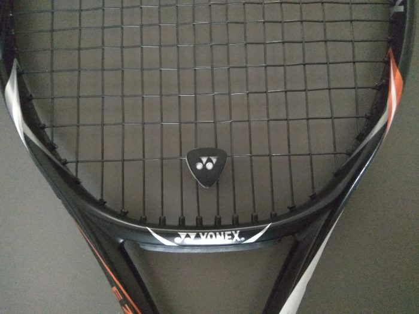
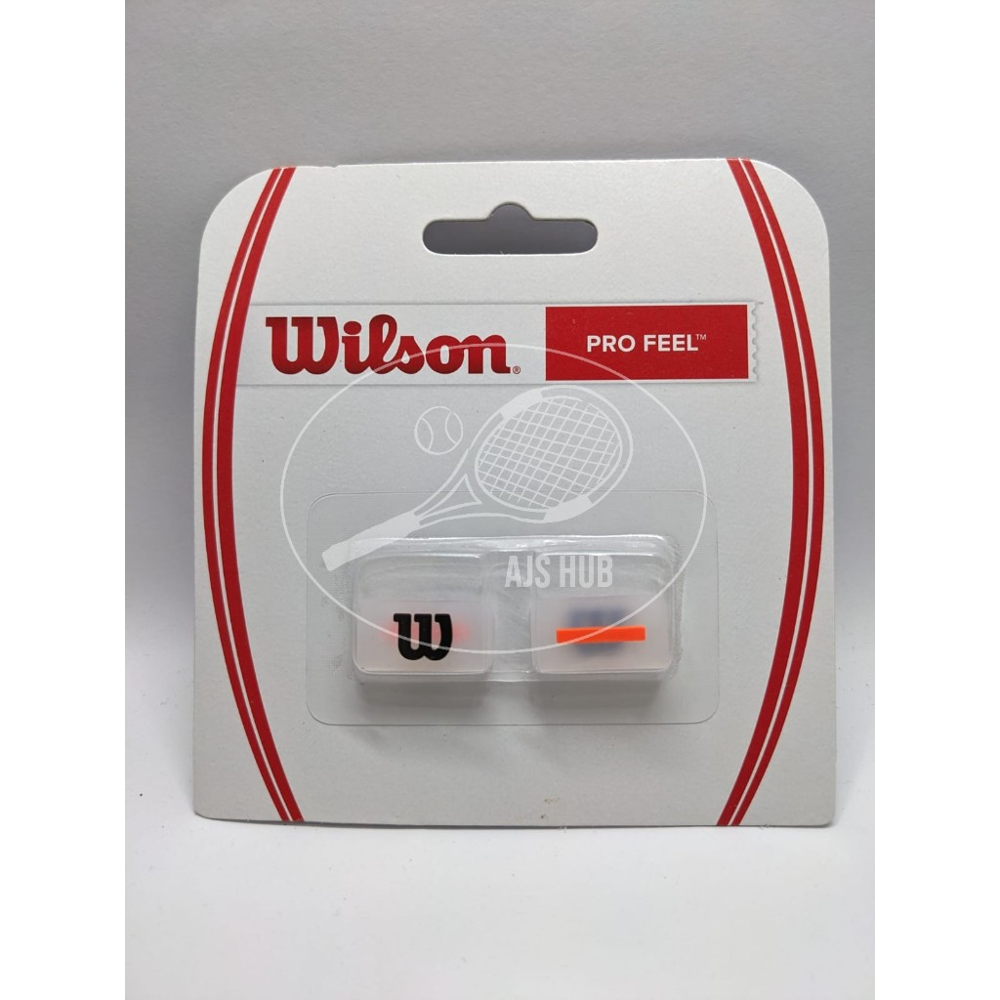
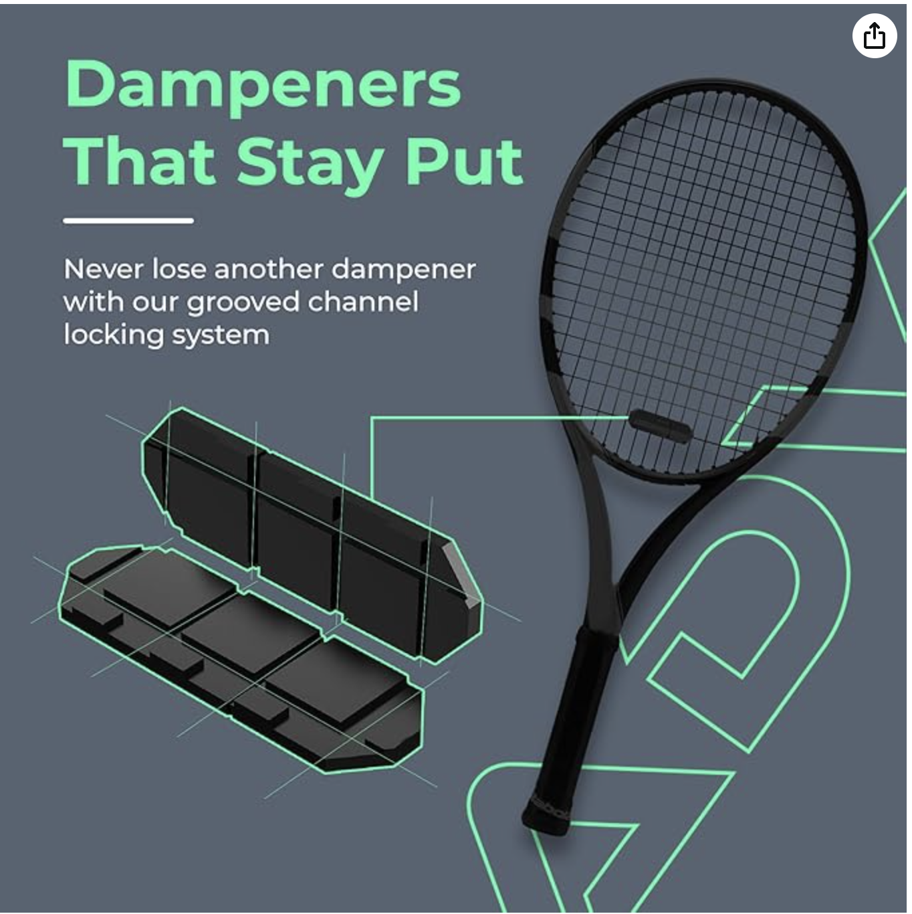
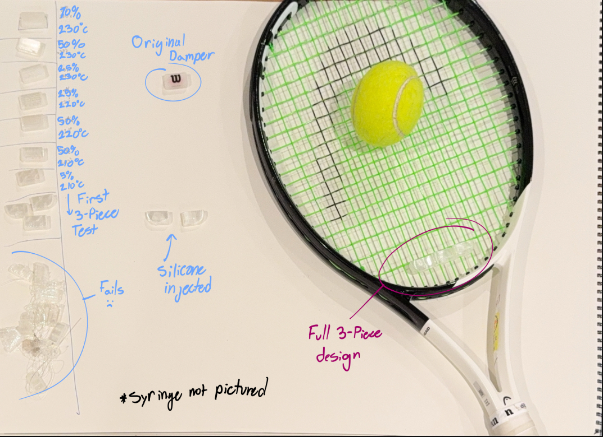
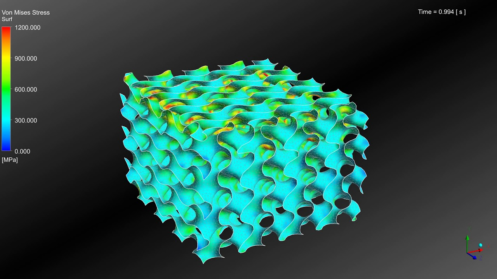

# 🎾 3D‑Printed Tennis Racket Damper – Rapid Prototype

## Project Overview
I decided to start a 24‑hour prototype challenge to create a vibration damper for a tennis racket, aiming to replicate the performance of commercial silicone dampers. The goal: design and manufacture a functional damper, that's cheaper than a traditional one, using my 3D-printer.

## My Design Process
The design I decided to follow for my testing trials was based off of a simple HEAD damper I have, which is pictured below:

Luckily this was easy to 3d model and helped me with my self-assigned time constraints. Later, you’ll see that I developed a modular, three-piece system—basically three of these head dampers—modeled after an [ADV tennis dampener](https://www.amazon.com/ADV-Tennis-Vibration-Absorbers-Technology/dp/B079R5PFKF?crid=2HOLDI99ZP8LE&dib=eyJ2IjoiMSJ9.nrf1_I_wBt4OMJR2QmMHFwiyHComH2TPeKWDk4HgCgaqgOa9e66G0WJ9m1hWSQ3CxNUOMamsThspIAVutDxP4-xiRcyWU4JpfraR9oxB_3m1eg4uy1FRydYfywwREzE3Nco303d9aOJsF7Huzspe-Yq91A3zEsG1ZFTx22mkbA5deWTQAxXfYtTgLyqdxHDKI-ia9cl6NL2I1Ka8e1BHbFXZWELs-TxzsSDZHAlHO8AJdQzs2_fZp7B_67NdX26NwRDYhpJiOKYL72Pn8q1wQ8dd0MP6utpUf1SkKi7tU2A.dKvL05d-yMK-eiL2FwurFMbQuPTEdOb1-8-ebDnk9N0&dib_tag=se&keywords=tennis%2Bdamper&qid=1749863405&sprefix=tennis%2Bdamper%2Caps%2C123&sr=8-17&th=1) design I discovered online. I read that the [ADV dampener](https://www.amazon.com/ADV-Tennis-Vibration-Absorbers-Technology/dp/B079R5PFKF?crid=2HOLDI99ZP8LE&dib=eyJ2IjoiMSJ9.nrf1_I_wBt4OMJR2QmMHFwiyHComH2TPeKWDk4HgCgaqgOa9e66G0WJ9m1hWSQ3CxNUOMamsThspIAVutDxP4-xiRcyWU4JpfraR9oxB_3m1eg4uy1FRydYfywwREzE3Nco303d9aOJsF7Huzspe-Yq91A3zEsG1ZFTx22mkbA5deWTQAxXfYtTgLyqdxHDKI-ia9cl6NL2I1Ka8e1BHbFXZWELs-TxzsSDZHAlHO8AJdQzs2_fZp7B_67NdX26NwRDYhpJiOKYL72Pn8q1wQ8dd0MP6utpUf1SkKi7tU2A.dKvL05d-yMK-eiL2FwurFMbQuPTEdOb1-8-ebDnk9N0&dib_tag=se&keywords=tennis%2Bdamper&qid=1749863405&sprefix=tennis%2Bdamper%2Caps%2C123&sr=8-17&th=1), with its design spanning multiple strings, was intended to aggressively dampen racket vibrations. That’s where I drew inspiration for my three-piece system.

## Material Testing & Printing Parameters
The first challenge was working with the TPU filament, which behaves differently based on print temperature and infill settings. Although the manufacturer-recommended printing temperature was 200 °C, I encountered persistent jams. By increasing the temperature to 210 °C, the printing process became stable and reliable, allowing for further experimentation. Additionally, I tested various infill percentages—from 70 % down to 0 %—and observed that lowering the infill increased elasticity. While a 5 % infill provided a suitably flexible print that fit well on the racket, it lacked the density necessary for effective vibration damping. This led to the decision to integrate silicone to enhance structural integrity.

As you can see in the image above, I experimented with various infill percentages, printing temperatures, and infill patterns. In my initial iterations, I tried a “gyroid” infill pattern, which looks like this: 

Later, I switched to a TPMS-D (Triply Periodic Minimal Surface) cell pattern, which was new to me and turned out to be much better suited for my future plans of injecting silicone into the damper(No picture avalible but it looks simalar to the gyroid design).

## Silicone Injection Process
As mentioned earlier, my experiments with different TPU variables showed that a lower infill percentage produced a more flexible print, making the damper feel much closer to the original silicone version I was using. While achieving this flexibility was one of my goals, the lack of internal material meant there was little to no actual vibration damping happening. Knowing this, I explored solutions for filling the damper’s interior with another material. While searching my garage, I found some silicone and decided to try a silicone-injected approach. Since the nozzle on the original silicone bottle was far too large for these small parts, I first transferred the silicone into a syringe to inject it into the partial 3D print. However, even the syringe tip was a bit too big for the fine channels in the print. To solve this, I designed and 3D-printed a custom nozzle that fit onto the syringe, making the injection size much smaller and allowing for more precise work at the scale of the 3D print. Pausing the print for manual injection required careful timing and precision. While several prints failed due to poor layer adhesion or contamination, a few did work, producing a silicone-filled structure that felt promising during initial tests(bouncing a tennis ball on the racket and feeling for vibrations and audible 'pinging' noises).

## Final Design: Modular Three-Wing Damper
The finalized design comprises three separate TPU wings (0 % infill, printed at 210 °C) with silicone injected into each cavity. This modular layout increases coverage across the strings, theoretically enhancing damping capability. Preliminary play tests confirmed a subtle yet noticeable difference in vibration and acoustics—the racket produced less “ping” and the feel during impact was more muted compared to playing without any damper.

## Cost Breakdown & Performance
Commercial silicone dampers range from $3.99 to $6.00 in retail outlets . In contrast, my wired calculations show my prototype costs approximately $0.10 per unit to produce. As for performance metrics, this remains qualitative; no specialized equipment was used. However, from personal testing, the silicone-injected prototype reduced vibration in a perceivable way, at least compared to using no damper.

# Future Directions & Improvements
This proof-of-concept reveals several clear paths for improvement:

**Refined injection process:** Develop a more precise method (potentially automated) for introducing silicone cleanly and consistently without layer failure.

**Design optimization:** Compare the current modular model with a single-piece design to evaluate differences in dampening effectiveness.

**Materials exploration:** Research additional filaments and elastomers for better integration or performance.

**Iterative testing:** Continue refining over time, particularly as dampers are lost during play—availability and ease of reprinting are key strengths of this approach.

Conclusion
This rapid prototype displays that combining flexible TPU and injected silicone can create a functional and ultra-low-cost vibration damper. Despite several failed prints during the process—a natural part of rapid prototyping—the final three-wing damper, manufactured in under 24 hours and costing roughly ten cents, delivered a noticeable reduction in vibration. With further development, this could evolve into a customizable and cost-effective alternative to standard commercial dampers.

